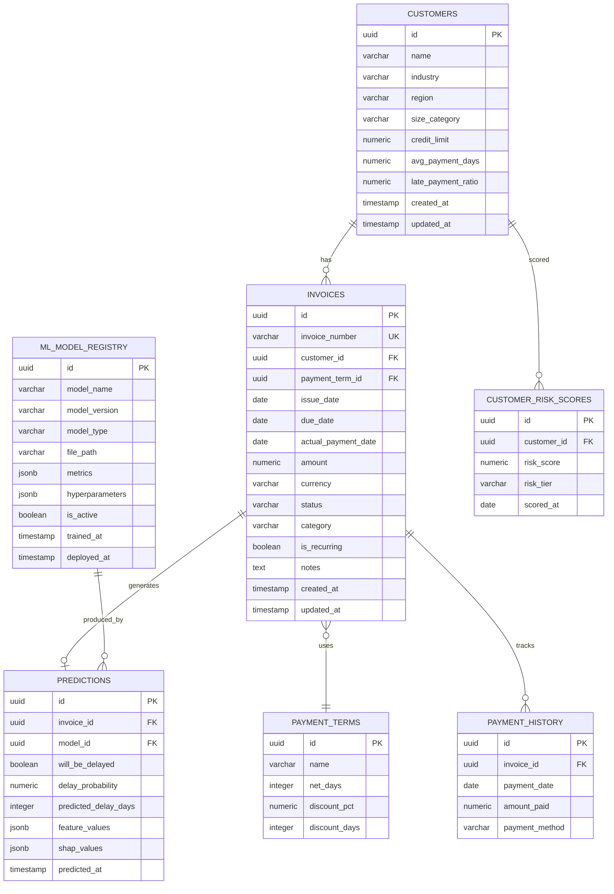

# Invoice Payment Delay Prediction System — Implementation Plan

## 1. Overview

Build an end-to-end system that:

| Goal | Output |
|---|---|
| **Classification** | Will this invoice be paid late? (yes / no) |
| **Regression** | If late, how many days late? |
| **Dashboard** | Power BI dashboard for business stakeholders |

**Tech stack:** Python (FastAPI) · PostgreSQL · scikit-learn / XGBoost / LightGBM · Power BI

---

## 2. Folder Structure

```
invoice-delay-system/
├── backend/
│   ├── app/
│   │   ├── __init__.py
│   │   ├── main.py                 # FastAPI entry-point
│   │   ├── config.py               # Settings (env vars, DB URL, etc.)
│   │   ├── database.py             # SQLAlchemy engine & session
│   │   ├── models/                 # ORM models
│   │   │   ├── __init__.py
│   │   │   ├── invoice.py
│   │   │   ├── customer.py
│   │   │   ├── prediction.py
│   │   │   └── model_registry.py
│   │   ├── schemas/                # Pydantic request/response schemas
│   │   │   ├── __init__.py
│   │   │   ├── invoice.py
│   │   │   ├── customer.py
│   │   │   └── prediction.py
│   │   ├── api/                    # Route handlers
│   │   │   ├── __init__.py
│   │   │   ├── invoices.py
│   │   │   ├── predictions.py
│   │   │   ├── customers.py
│   │   │   ├── analytics.py
│   │   │   └── model_mgmt.py
│   │   ├── services/               # Business logic
│   │   │   ├── __init__.py
│   │   │   ├── invoice_service.py
│   │   │   ├── prediction_service.py
│   │   │   └── analytics_service.py
│   │   ├── ml/                     # ML inference engine
│   │   │   ├── __init__.py
│   │   │   ├── feature_engineering.py
│   │   │   ├── predictor.py
│   │   │   └── model_loader.py
│   │   └── utils/
│   │       ├── __init__.py
│   │       └── helpers.py
│   ├── tests/
│   │   ├── __init__.py
│   │   ├── test_invoices.py
│   │   ├── test_predictions.py
│   │   └── test_ml.py
│   ├── alembic/                    # DB migrations
│   │   ├── env.py
│   │   └── versions/
│   ├── alembic.ini
│   ├── requirements.txt
│   └── Dockerfile
├── data/
│   ├── raw/                        # Original CSVs / exports
│   ├── processed/                  # Cleaned datasets
│   └── sample/                     # Small sample for dev / tests
├── notebooks/
│   ├── 01_eda.ipynb                # Exploratory Data Analysis
│   ├── 02_feature_engineering.ipynb
│   ├── 03_model_training.ipynb
│   ├── 04_model_evaluation.ipynb
│   └── 05_hyperparameter_tuning.ipynb
├── ml_models/                      # Serialised models (*.joblib)
│   ├── classifier/
│   └── regressor/
├── dashboard/
│   ├── Invoice_Delay_Dashboard.pbix
│   ├── queries/                    # Power BI SQL / DAX queries
│   │   ├── delay_overview.sql
│   │   ├── customer_risk.sql
│   │   └── trend_analysis.sql
│   └── README.md
├── sql/
│   ├── 001_create_tables.sql
│   ├── 002_seed_data.sql
│   ├── 003_create_views.sql
│   └── 004_create_indexes.sql
├── frontend/                       # (Optional) lightweight web UI
│   └── ...
├── docs/
│   ├── architecture.md
│   ├── roadmap.md
│   └── tasks.md
├── docker-compose.yml
├── .env.example
├── .gitignore
└── README.md
```

---

## 3. Database Schema (PostgreSQL)

### 3.1 ER Diagram



### 3.2 Key design decisions

| Decision | Rationale |
|---|---|
| UUIDs for PKs | Safer for distributed systems & external API exposure |
| `predictions.shap_values` as JSONB | Flexible per-feature explanations without schema changes |
| `ml_model_registry` table | Track model lineage; easy A/B testing & rollback |
| `customer_risk_scores` | Pre-computed aggregate for fast dashboard queries |
| Separate `payment_terms` | Normalised; avoids duplicating term logic in every invoice |

---

## 4. API Endpoints

Base URL: `/api/v1`

### 4.1 Invoices

| Method | Path | Description |
|---|---|---|
| `POST` | `/invoices` | Create a new invoice |
| `GET` | `/invoices` | List invoices (paginated, filterable) |
| `GET` | `/invoices/{id}` | Get invoice detail |
| `PUT` | `/invoices/{id}` | Update invoice |
| `DELETE` | `/invoices/{id}` | Soft-delete invoice |
| `POST` | `/invoices/bulk` | Bulk import invoices (CSV upload) |

### 4.2 Predictions

| Method | Path | Description |
|---|---|---|
| `POST` | `/predictions/single` | Predict delay for a single invoice |
| `POST` | `/predictions/batch` | Predict delay for multiple invoices |
| `GET` | `/predictions/{invoice_id}` | Get prediction for an invoice |
| `GET` | `/predictions/history` | Prediction audit trail |

#### Example — `POST /predictions/single` request

```json
{
  "invoice_id": "a1b2c3d4-...",
  "features_override": {}
}
```

#### Example — response

```json
{
  "invoice_id": "a1b2c3d4-...",
  "will_be_delayed": true,
  "delay_probability": 0.82,
  "predicted_delay_days": 12,
  "risk_tier": "HIGH",
  "top_factors": [
    {"feature": "customer_late_payment_ratio", "impact": 0.34},
    {"feature": "invoice_amount", "impact": 0.21},
    {"feature": "days_until_due", "impact": 0.15}
  ],
  "model_version": "v2.1.0",
  "predicted_at": "2026-04-19T00:00:00Z"
}
```

### 4.3 Customers

| Method | Path | Description |
|---|---|---|
| `POST` | `/customers` | Create customer |
| `GET` | `/customers` | List customers |
| `GET` | `/customers/{id}` | Customer detail + risk score |
| `GET` | `/customers/{id}/invoices` | Customer's invoices |
| `GET` | `/customers/{id}/risk-history` | Risk score over time |

### 4.4 Analytics (feeds Power BI)

| Method | Path | Description |
|---|---|---|
| `GET` | `/analytics/delay-overview` | Aggregate delay stats |
| `GET` | `/analytics/delay-trend` | Monthly delay trend |
| `GET` | `/analytics/customer-risk` | Customer risk distribution |
| `GET` | `/analytics/model-performance` | Live model accuracy metrics |
| `GET` | `/analytics/aging-buckets` | AR aging analysis |

### 4.5 Model Management

| Method | Path | Description |
|---|---|---|
| `POST` | `/models/register` | Register a trained model |
| `GET` | `/models` | List registered models |
| `PUT` | `/models/{id}/activate` | Set model as active for inference |
| `GET` | `/models/{id}/metrics` | View training & live metrics |

---

## 5. Recommended ML Models

### 5.1 Classification — "Will this invoice be delayed?"

| Model | Why | Notes |
|---|---|---|
| **XGBoost Classifier** ⭐ | Best balance of accuracy, speed, and interpretability | Primary recommendation |
| **LightGBM Classifier** | Faster training on large datasets; similar accuracy | Good alternative for >1M rows |
| **Random Forest** | Robust baseline, less tuning required | Use as baseline comparison |
| **Logistic Regression** | Simple, fully interpretable | Benchmark model |

### 5.2 Regression — "How many days late?"

| Model | Why | Notes |
|---|---|---|
| **XGBoost Regressor** ⭐ | Handles non-linear delay patterns well | Primary recommendation |
| **LightGBM Regressor** | Slightly faster; good with categorical features | Strong alternative |
| **Ridge Regression** | Interpretable linear baseline | Benchmark |

### 5.3 Key Features to Engineer

```
┌──────────────────────────────────────────────────────────┐
│  INVOICE FEATURES         │  CUSTOMER FEATURES           │
│  ─────────────────        │  ──────────────────          │
│  • invoice_amount         │  • avg_payment_days          │
│  • days_until_due         │  • late_payment_ratio        │
│  • invoice_age            │  • total_invoices            │
│  • payment_term_net_days  │  • credit_limit              │
│  • is_recurring           │  • industry                  │
│  • invoice_category       │  • region                    │
│  • month_issued           │  • customer_tenure_days      │
│  • day_of_week_issued     │  • size_category             │
│  • quarter_issued         │  • outstanding_balance       │
│                           │                              │
│  DERIVED / INTERACTION    │  HISTORICAL PATTERNS         │
│  ─────────────────────    │  ────────────────────        │
│  • amount_to_credit_ratio │  • rolling_30d_delay_rate    │
│  • is_month_end           │  • rolling_90d_avg_delay     │
│  • is_quarter_end         │  • seasonal_delay_factor     │
│  • amount_bucket          │  • consecutive_late_count    │
└──────────────────────────────────────────────────────────┘
```

### 5.4 Model Evaluation Metrics

| Task | Primary Metric | Secondary Metrics |
|---|---|---|
| Classification | **F1-Score** (delay class) | Precision, Recall, AUC-ROC, PR-AUC |
| Regression | **MAE** (mean absolute error) | RMSE, R², MAPE |

### 5.5 Explainability

- **SHAP values** stored per-prediction for feature attribution
- **Feature importance charts** in Power BI via the analytics API
- Per-prediction "top factors" returned in the API response

---

## 6. Power BI Dashboard Design

### Pages

| Page | Key Visuals |
|---|---|
| **Executive Summary** | KPI cards (total invoices, delay rate, avg delay days, total at-risk amount), trend line |
| **Delay Analysis** | Delay distribution histogram, delay by category/region heatmap, aging buckets |
| **Customer Risk** | Risk tier pie chart, top-10 riskiest customers table, customer drill-through |
| **Prediction Performance** | Predicted vs. actual scatter, confusion matrix, F1 over time |
| **Trend & Forecast** | Monthly delay trend, seasonal decomposition, forecast line |

### Data Connection

Power BI → **DirectQuery** or **Scheduled Refresh** against the PostgreSQL views exposed by the analytics API or directly via the `003_create_views.sql` database views.

---