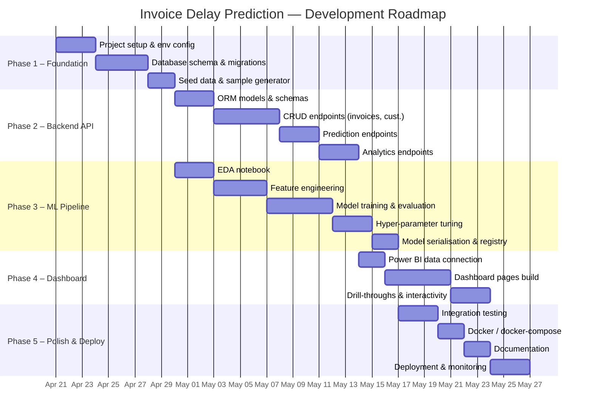

use roadmap.png

```mermaid
gantt
    title Invoice Delay Prediction — Development Roadmap
    dateFormat  YYYY-MM-DD
    axisFormat  %b %d

    section Phase 1 – Foundation
    Project setup & env config       :p1a, 2026-04-21, 3d
    Database schema & migrations     :p1b, after p1a, 4d
    Seed data & sample generator     :p1c, after p1b, 2d

    section Phase 2 – Backend API
    ORM models & schemas             :p2a, after p1c, 3d
    CRUD endpoints (invoices, cust.) :p2b, after p2a, 5d
    Prediction endpoints             :p2c, after p2b, 3d
    Analytics endpoints              :p2d, after p2c, 3d

    section Phase 3 – ML Pipeline
    EDA notebook                     :p3a, after p1c, 3d
    Feature engineering              :p3b, after p3a, 4d
    Model training & evaluation      :p3c, after p3b, 5d
    Hyper-parameter tuning           :p3d, after p3c, 3d
    Model serialisation & registry   :p3e, after p3d, 2d

    section Phase 4 – Dashboard
    Power BI data connection         :p4a, after p2d, 2d
    Dashboard pages build            :p4b, after p4a, 5d
    Drill-throughs & interactivity   :p4c, after p4b, 3d

    section Phase 5 – Polish & Deploy
    Integration testing              :p5a, after p3e, 3d
    Docker / docker-compose          :p5b, after p5a, 2d
    Documentation                    :p5c, after p5b, 2d
    Deployment & monitoring          :p5d, after p5c, 3d
```

---